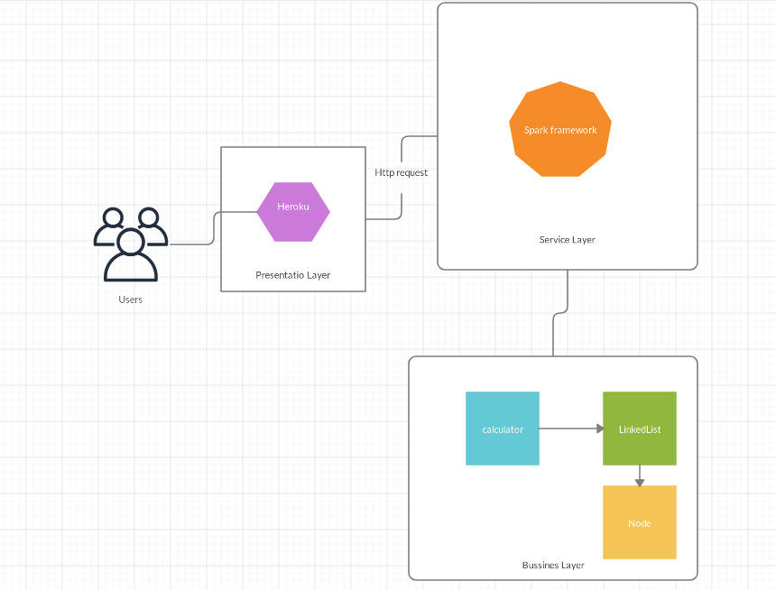
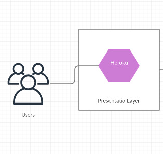
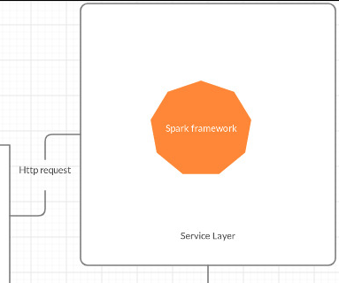

#lab2AREP

## instalación

para poder instalar la aplicacion seguir los siguientes pasos:

* Clonar el proyecto del ropositorio

````
git clone https://github.com/GrCross/lab2AREP.git
````
* descargar las dependencias
````
mvn package
````
* compilar el proyecto
````
mvn compile
````

## Uso
Para usar la aplicacion **localmente** una vez instalada es necesario ir a la raiz del proyecto y desde el cmd usar el siguiente comando:

````
mvn exec:java -Dexec.mainClass="co.edu.escuelaing.sparksimpleexample.SparkWebApp"
````

una vez abierta la aplicacion aparecera la siguiente página:


En el cuadro de texto podra colocar una lista de numeros separados por el siguiente caracter "/" ej: *4.5/6.4/3.7/9.0*

se dara submit y se mostraran los resulados en la pantalla.

## Pruebas

para ejecutar las pruebas ejecute el siguiente comando:

````
mvn test
````

existen 2 casos de pruebas, uno para la media y otro para la desviacion y usan los siguientes casos

test1


test2


## arquitectura y modelos de la aplicacion

En la arquitectura de la aplicacion se pueden identificar 3 diferentes capas

* Presentation layer
* Service layer
* Bussines layer





### presentation layer

Esta capa de la arquitectura se encarga de la interaccion directa con el usuario



### Service layer

Esta capa se encarga de prestar todos los servicios que ofrece la aplicacion.

Esta capa se comunica con la capa de presentacion por medio de **peticiones http**

